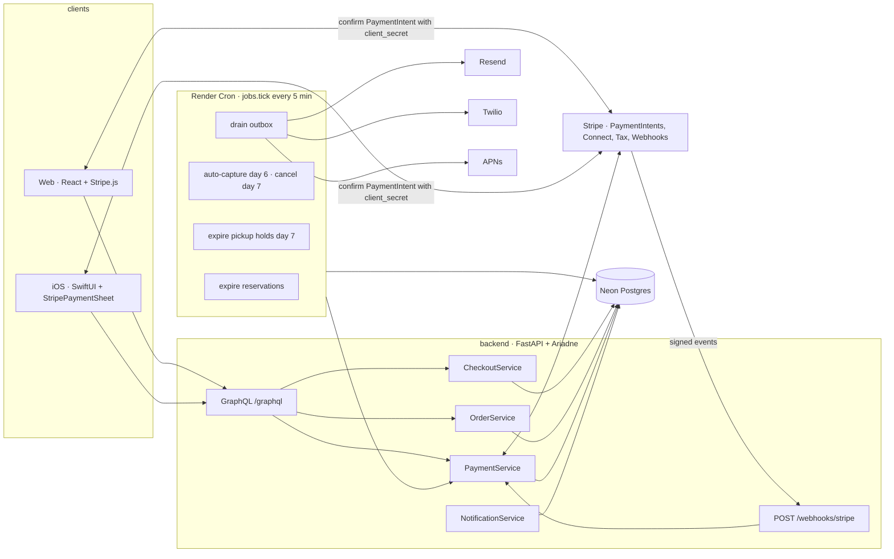
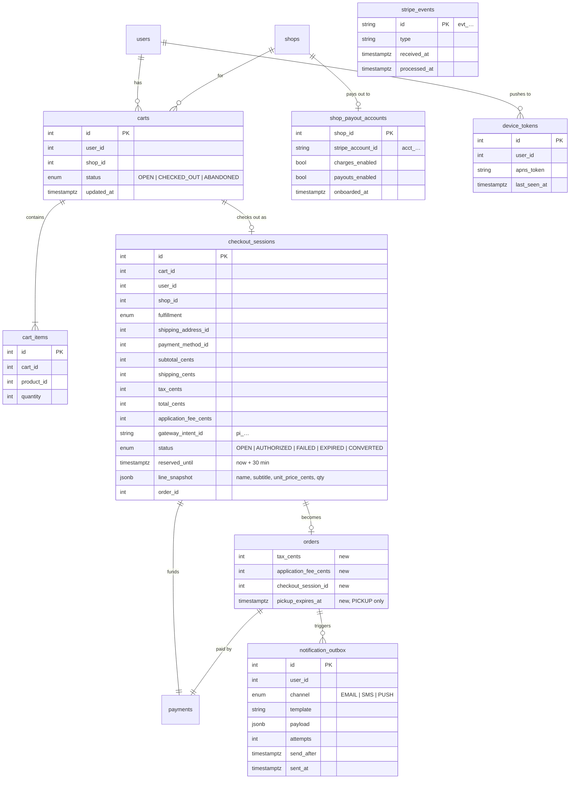
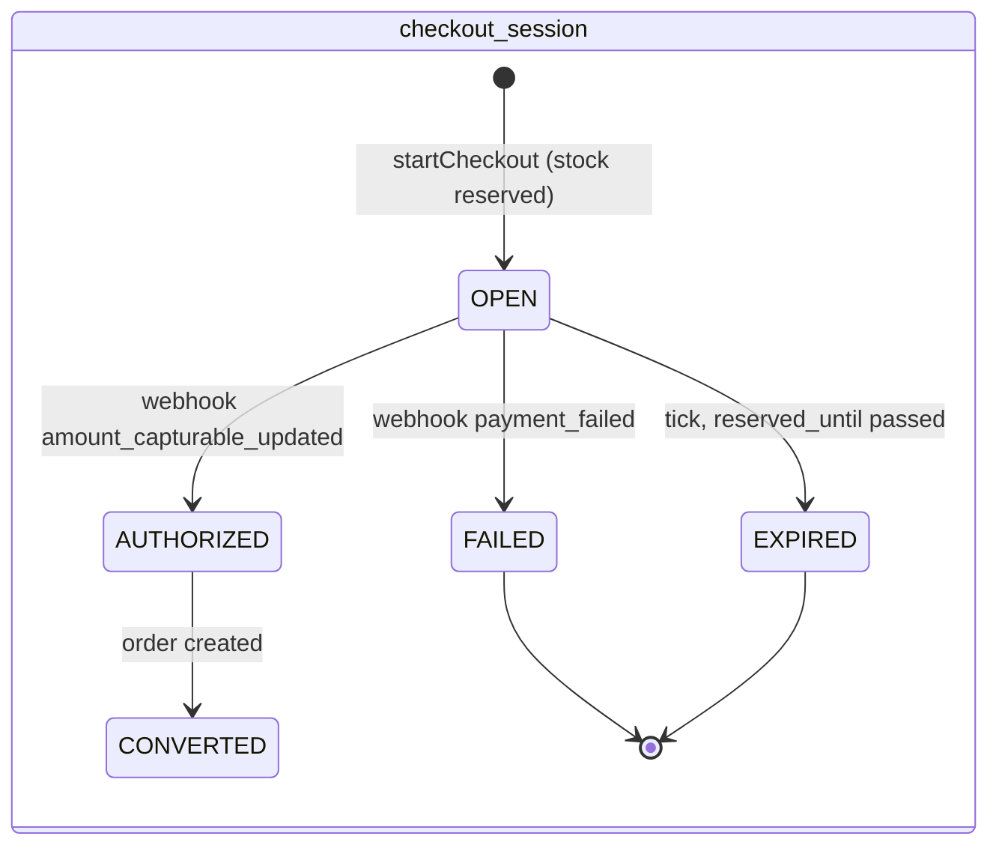
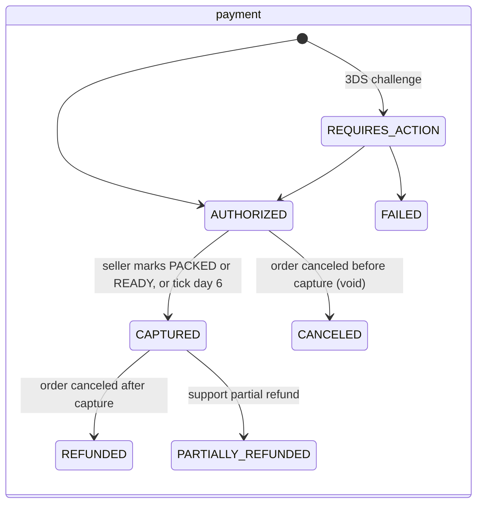
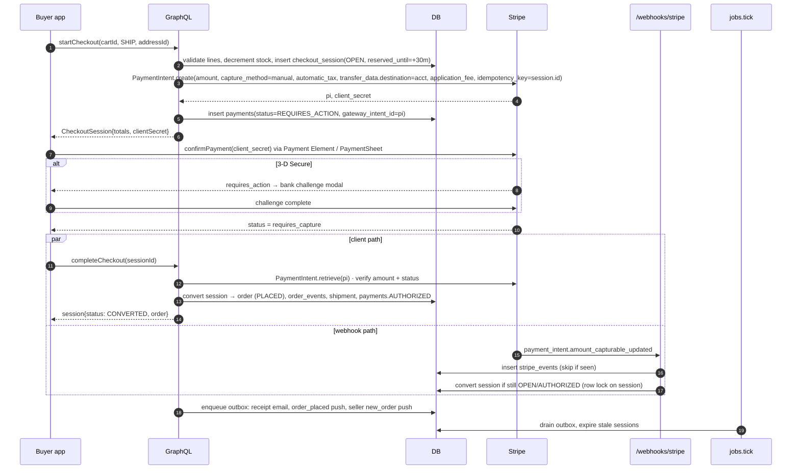

# Checkout, payment, and buyer orders

System design for the buyer purchase flow: add to cart → checkout → payment → confirmation → order tracking. Companion Figma: [Checkout & Orders — buyer flow](https://www.figma.com/design/3lR5C4ZhUKXctW3tnmDAts?node-id=213-2) (web 1440 + iOS 393, same `KYC Tokens`).

## 1. Today

| Layer | State |
|---|---|
| Web `ListingGrid` | "Add to cart" calls `say('Checkout is coming soon…')`. No cart. |
| iOS `ShopListingsPanel` | "+" shows a "Checkout is coming soon" alert. No cart. |
| GraphQL | `placeOrder(shopId, items, fulfillment)` exists and is callable. It creates the order, decrements stock, writes `order_events`, creates a `shipments` row for SHIP. Nothing calls it. |
| Payment | `payment_methods`, `payments`, `payment_transactions` tables exist (migration 0036). No Stripe SDK, no webhook, `orders.payment_id` is always null. |
| Address | `addresses` table exists. `placeOrder` always writes `shipping_address_id = NULL`. |
| Tax | None. `total_cents = subtotal + shipping`. |
| Buyer views | `myPurchases` query exists. No screen on web or iOS renders it. |
| Seller side | Seller Hub lists orders, marks packed/shipped/ready/picked up, cancels (restocks, deletes shipment). |

So a buyer today cannot pay, cannot give an address, and cannot see an order. The seller tooling and the order state machine are already in place; this design adds everything in front of them and wires money through them.

## 2. Goals and non-goals

Goals

- One-shop cart, single-page checkout, ship or pickup, pay by card / Apple Pay / Google Pay / Link.
- Money reaches the shop, platform keeps a fee, buyer is refunded automatically when a shop cancels.
- Buyer can see every order, its status, tracking, and pickup code on web and iOS.
- No card data touches our servers (PCI SAQ A).
- Every state change is server-owned, idempotent, and recorded in `order_events`.

Non-goals (v1)

- Multi-shop carts, promo codes beyond a UI slot, gift cards, tipping.
- Shipping labels and rate shopping. Sellers keep entering carrier + tracking.
- Returns. Refunds are seller-initiated full refunds plus support-initiated partial refunds.
- Reviews. The screens reserve the entry point only.

## 3. Key decisions

| Decision | Choice | Why |
|---|---|---|
| Payment processor | Stripe, Connect Express accounts per shop, destination charges | Marketplace standard. Sellers onboard in a Stripe-hosted flow; Stripe handles KYC, 1099s, payouts. Destination charge keeps us merchant of record for the buyer and tax. |
| Charge timing | Authorize at checkout, capture when the shop marks PACKED / READY_FOR_PICKUP, auto-capture at day 6 | Sellers can cancel without a refund; buyer sees a pending charge, not a charge-then-refund. Card auths expire at 7 days, so the order auto-cancels at day 7 if untouched. |
| Card entry | Stripe Payment Element (web), PaymentSheet (iOS), Express Checkout Element for wallets | Card fields render in Stripe iframes/SDK. We never see a PAN. Apple Pay and Link come free. |
| Tax | Stripe Tax, `automatic_tax` on the PaymentIntent | CA district taxes are per-address. Marketplace facilitator rules make the platform liable, so the platform calculates and remits. |
| Cart | Server-side `carts` table, one open cart per `(user, shop)`; anonymous cart kept on device until sign-in | Cross-device, survives reinstall, lets the server validate stock before checkout. Sign-in is already required to buy. |
| Inventory | Reserve at `startCheckout`, release on expiry (30 min) or failure, convert to the order on authorization | Prevents two buyers paying for the last bag. Reuses the atomic decrement already in `OrderRepository.create`. |
| Source of truth for payment | Stripe webhooks. Client-side confirm result only drives UI | Clients lose network after Pay. The webhook retries; the order must exist even if the app died. |
| Idempotency | `checkout_sessions.id` is the Stripe idempotency key; `payments.gateway_intent_id` is unique | Double taps and webhook redelivery become no-ops. |
| Background work | One `jobs.tick` entry point run by Render Cron every 5 min | Render free plan has no workers. Tick handles reservation expiry, auto-capture, auth-expiry cancel, pickup-hold expiry, outbox delivery. |
| Notifications | `notification_outbox` table drained by tick; Resend (email), Twilio (SMS), APNs (push) | Email and SMS senders already exist for sign-in codes. Outbox makes delivery retryable and auditable. |

## 4. Architecture



Money path: buyer card → Stripe → platform balance → automatic transfer to the shop's Connect account minus `application_fee_amount`. Refunds reverse the transfer.

## 5. Data model

Existing tables kept as-is: `orders`, `order_items`, `order_events`, `shipments`, `addresses`, `payment_methods`, `payments`, `payment_transactions`, `products`, `shops`, `users`.

New and changed:



Notes

- `checkout_sessions.line_snapshot` is the only thing `placeOrder` reads at conversion. Prices cannot drift between authorize and order creation.
- Stock is decremented when the session is created and restored when it expires or fails. `orders` conversion does not touch stock again.
- `payments.order_id` becomes nullable. A payment exists from `startCheckout`; `order_id` is set at conversion.
- `users` gains `phone_for_updates`, `sms_opt_in`. `addresses` is used as designed: immutable rows, edit = new row + soft delete.

## 6. State machines





Order status is unchanged from `enums.py`: SHIP `PLACED → PACKED → SHIPPED → DELIVERED`, PICKUP `PLACED → READY_FOR_PICKUP → PICKED_UP`, `CANCELED` from any `CANCELABLE_STATUSES`. The one addition: `PICKED_UP` and `DELIVERED` also set when the shop enters the pickup code or the carrier scan arrives.

Coupling rules (enforced in `OrderService`, never in clients):

| Order event | Payment action |
|---|---|
| `MARK_PACKED`, `MARK_READY_FOR_PICKUP` | capture full amount |
| buyer `CANCEL` while PLACED | void authorization |
| seller `CANCEL` before capture | void authorization |
| seller `CANCEL` after capture | full refund, reverse transfer |
| tick: AUTHORIZED and 6 days old | capture (avoid auth expiry) |
| tick: PLACED and 7 days old, never captured | cancel + void, notify both sides |
| tick: READY_FOR_PICKUP and `pickup_expires_at` passed | cancel + refund, restock |

Buyer cancel is PLACED only. Seller cancel is allowed until SHIPPED / PICKED_UP.

## 7. GraphQL API

Additions to `schema.graphql`. All require sign-in; ownership checks as noted.

```graphql
type Cart implements Node {
  id: ID!
  shop: CoffeeShop!
  items: [CartItem!]!
  subtotal: Float!
  "Null when the shop has no free-shipping threshold or it is already met."
  amountToFreeShipping: Float
  updatedAt: String!
}
type CartItem { product: Product!, qty: Int!, unitPrice: Float!, "Stock left; drives the qty stepper cap." available: Int! }

type CheckoutSession implements Node {
  id: ID!
  cart: Cart!
  fulfillment: Fulfillment!
  shippingAddress: Address
  subtotal: Float!  shipping: Float!  tax: Float!  total: Float!
  "Stripe PaymentIntent client secret; the client confirms with it."
  clientSecret: String!
  "Stripe publishable key + Connect account for the Payment Element."
  stripeAccountId: String!
  status: CheckoutStatus!
  "ISO; stock is held until this time."
  reservedUntil: String!
  order: Order
}
enum CheckoutStatus { OPEN AUTHORIZED FAILED EXPIRED CONVERTED }

type Address implements Node { id: ID!, fullName: String!, line1: String!, line2: String, city: String!, state: String!, postalCode: String!, countryCode: String!, phone: String, isDefault: Boolean! }
input AddressInput { fullName: String!, line1: String!, line2: String, city: String!, state: String!, postalCode: String!, countryCode: String = "US", phone: String, isDefault: Boolean = false }

type PaymentMethod implements Node { id: ID!, brand: String!, last4: String!, expMonth: Int!, expYear: Int!, isDefault: Boolean! }

extend type Order {
  tax: Float!
  shippingAddress: Address
  payment: PaymentSummary
  "4-digit code; PICKUP only; null once picked up or canceled."
  pickupCode: String
  pickupExpiresAt: String
  "Append-only timeline for the order page."
  events: [OrderEvent!]!
  "What the viewer may do now; clients render buttons from this, not from status."
  buyerActions: [BuyerAction!]!
}
type PaymentSummary { methodDisplay: String!, status: PaymentStatus!, amountCaptured: Float!, amountRefunded: Float!, receiptUrl: String }
type OrderEvent { status: OrderStatus!, note: String, createdAt: String! }
enum BuyerAction { CANCEL TRACK SHOW_PICKUP_CODE MESSAGE_SHOP REPORT_PROBLEM BUY_AGAIN }

extend type Query {
  "Open cart for one shop, or every open cart when shopId is omitted."
  myCart(shopId: ID): Cart
  myCarts: [Cart!]!
  checkoutSession(id: ID!): CheckoutSession
  myAddresses: [Address!]!
  myPaymentMethods: [PaymentMethod!]!
  "Replaces myPurchases. Newest first; status filters to a group."
  myOrders2(status: BuyerOrderFilter = ALL, limit: Int! = 20, offset: Int! = 0): OrderPage!
  order(id: ID!): Order  "Buyer, shop owner, or admin."
}
enum BuyerOrderFilter { ALL IN_PROGRESS DELIVERED CANCELED }

extend type Mutation {
  "Adds to the open cart for that shop. replaceCart=true drops any other shop's cart."
  addToCart(productId: ID!, qty: Int! = 1, replaceCart: Boolean = false): Cart!
  setCartItemQty(productId: ID!, qty: Int!): Cart!   "qty 0 removes."
  clearCart(shopId: ID!): Boolean!

  saveAddress(input: AddressInput!): Address!
  deleteAddress(id: ID!): Boolean!

  """
  Validates the cart, reserves stock for 30 min, computes shipping and tax,
  creates the PaymentIntent (manual capture, destination = shop account).
  Idempotent per cart: calling again returns the same OPEN session with
  refreshed totals. Errors: CART_EMPTY, OUT_OF_STOCK(productId),
  FULFILLMENT_NOT_OFFERED, SHOP_NOT_PAYABLE, ADDRESS_REQUIRED.
  """
  startCheckout(cartId: ID!, fulfillment: Fulfillment!, shippingAddressId: ID, pickupPhone: String, smsOptIn: Boolean = true): CheckoutSession!
  "Re-price after the buyer changes fulfillment or address. Same session id."
  updateCheckout(id: ID!, fulfillment: Fulfillment, shippingAddressId: ID): CheckoutSession!
  """
  Called by the client after Stripe confirms. Verifies the PaymentIntent
  server-side and converts the session to an order if the webhook has not
  already. Safe to call repeatedly; returns the order when it exists.
  """
  completeCheckout(id: ID!): CheckoutSession!

  cancelOrder(id: ID!, reason: String): Order!   "Existing; now voids or refunds."
  registerDevice(apnsToken: String!): Boolean!
}
```

`placeOrder` is removed from the public schema once `completeCheckout` ships. Its internals move into `OrderService.convert(session)`.

REST endpoint outside GraphQL: `POST /webhooks/stripe`. Verifies `Stripe-Signature`, inserts into `stripe_events` (PK = event id, so redelivery is a no-op), then dispatches.

## 8. Flows

### 8.1 Add to cart

1. Client calls `addToCart`. If the user is signed out, the client opens the sign-in sheet, then replays the call.
2. Server loads the open cart for `(user, shop)`. If an open cart exists for a different shop, return error `OTHER_SHOP_CART` with that shop's name; client shows Replace / Keep; Replace retries with `replaceCart: true`.
3. Server clamps `qty` to `product.quantity`, upserts the line, returns the cart.
4. Web opens the cart drawer; iOS shows the toast + floating cart bar.

### 8.2 Checkout and payment



Conversion is guarded by `SELECT … FOR UPDATE` on the session row and `UNIQUE(payments.gateway_intent_id)`. Whichever path arrives second finds `CONVERTED` and returns the existing order.

Failure paths

- `payment_intent.payment_failed` → session `FAILED`, stock restored, payment `FAILED` with `failure_reason`. Client shows the inline decline panel; the cart is intact; next Pay calls `startCheckout` again and gets a fresh PaymentIntent.
- Reservation expires (buyer walked away) → tick marks `EXPIRED`, restores stock, cancels the PaymentIntent. If the buyer returns, the client gets `EXPIRED` and calls `startCheckout` again.
- Stock changed between cart and `startCheckout` → `OUT_OF_STOCK(productId)`; client shows the "stock changed" panel with the offending line.
- Shop has no payable Connect account → `SHOP_NOT_PAYABLE`; listing pages hide Add to cart for such shops, so this is a race only.

### 8.3 Capture, cancel, refund

- Seller `markPacked` / `markReadyForPickup` → `OrderService.transition` → `PaymentService.capture(pi)` inside the same request. If capture fails (card closed), the transition is rolled back and the seller sees "Payment could not be captured; contact buyer".
- Buyer `cancelOrder` on PLACED → `PaymentIntent.cancel` (void). Restock, delete shipment, event `CANCELED` with actor = buyer.
- Seller `cancelOrder` after capture → `Refund.create(reverse_transfer=true, refund_application_fee=true)`. `payments.amount_refunded_cents` updated from the `charge.refunded` webhook.
- Every Stripe call writes a `payment_transactions` row with request and response JSON.

### 8.4 Pickup

1. `startCheckout(…, PICKUP)` skips address and shipping, sets `pickup_expires_at = now + 7d` at conversion, generates the 4-digit `pickup_code` (existing helper), unique among that shop's open PICKUP orders.
2. Seller taps Ready → capture → outbox `ready_for_pickup` (push + SMS).
3. At the counter the seller enters the code or taps Mark picked up → `PICKED_UP`, code nulled in API responses.
4. Tick: `READY_FOR_PICKUP` past `pickup_expires_at` → cancel + refund + restock, notify both. One day before, outbox `pickup_expiring`.

### 8.5 Tracking and delivery

Unchanged seller flow (`updateShipment`). v1.1: EasyPost tracker webhook → `shipments.tracking_status`, moves order to SHIPPED / DELIVERED via `SHIPMENT_TO_ORDER_STATUS`, enqueues `out_for_delivery` and `delivered`.

## 9. Clients

### Web (`web/src`)

| Route | Screen | Figma |
|---|---|---|
| any shop page | cart drawer (`CartDrawer`), opened by Add to cart and the header Cart button | Web / Checkout 1 |
| `/checkout/:sessionId` | `CheckoutPage`: Express Checkout Element on top, Payment Element below, sticky `OrderSummary` | Web / Checkout 2, 2b |
| `/orders/:id/confirmed` | `OrderConfirmedPage` | Web / Checkout 3 |
| `/orders` | `OrdersPage`, filter tabs map to `BuyerOrderFilter` | Web / Orders 1 |
| `/orders/:id` | `OrderPage`, buttons from `buyerActions` | Web / Orders 2, 2b |

Stripe: `@stripe/stripe-js` + `@stripe/react-stripe-js`. `loadStripe(pk, { stripeAccount })` with the shop's Connect account. Confirm with `stripe.confirmPayment({ elements, redirect: 'if_required' })`; on success call `completeCheckout` and navigate. Anonymous cart lives in `localStorage` under `kyc.cart` and is merged by calling `addToCart` for each line after sign-in.

### iOS (`ios/KnowYourCoffee`)

| Entry | Screen | Figma |
|---|---|---|
| `ShopListingsPanel` "+" | toast + `CartBar` overlay on `ShopPageView` | iOS / Checkout 1 |
| `CartBar` tap | `CartSheet` (`.presentationDetents([.large])`) | iOS / Checkout 2 |
| Checkout button | `CheckoutView` with sticky Pay bar; `PaymentSheet` from `StripePaymentSheet` | iOS / Checkout 3, 3b, 3c |
| success | `OrderConfirmedView` | iOS / Checkout 4, 4b |
| Me tab → Your orders, push deep link | `OrdersView`, `OrderDetailView` | iOS / Orders 1, 2 |

Stripe: `StripePaymentSheet` SPM package, `PaymentSheet.Configuration` with `applePay(merchantId:)`, `customer` ephemeral key for saved cards, `returnURL` for 3DS. Apple Pay needs a merchant ID and the Apple Pay capability in `KnowYourCoffee.entitlements`. Pickup code Wallet pass uses PassKit with a server-signed `.pkpass` (v1.1). `registerDevice` runs after push permission.

## 10. Edge cases

| Case | Handling |
|---|---|
| Double tap on Pay | Button disables on first tap; `startCheckout` is idempotent per cart; Stripe idempotency key = session id. |
| App killed after Stripe confirm | Webhook converts the session. On relaunch the client calls `checkoutSession(id)`, sees `CONVERTED`, routes to the order. |
| Webhook before `completeCheckout` | Normal. `completeCheckout` finds `CONVERTED` and returns the order. |
| Webhook delayed > 30 min | `tick` must not expire a session whose PaymentIntent is `requires_capture`; it checks Stripe before expiring. |
| Price edited during checkout | Session snapshot wins. Seller edits take effect on the next cart. |
| Shop turns off shipping mid-checkout | `updateCheckout` returns `FULFILLMENT_NOT_OFFERED`; client flips the toggle to pickup with an inline note, or blocks Pay if neither remains. |
| Buyer deletes account | `buyer_user_id` nulls (existing). Open orders are canceled and refunded first by `deleteAccount`. |
| Shop loses Connect `charges_enabled` | `account.updated` webhook sets the flag; listings hide Add to cart; `startCheckout` returns `SHOP_NOT_PAYABLE`. |
| Capture fails at pack time | Transition rolls back. Order stays PLACED with an event note; seller sees a retry. Tick retries capture hourly for 24 h, then cancels. |
| Currency | USD only. `currency` columns exist for later. |

## 11. Security and compliance

- PCI: SAQ A. Card data only in Stripe iframes / SDK. `payment_methods` stores `pm_…` + brand/last4.
- Webhook: verify `Stripe-Signature` with `STRIPE_WEBHOOK_SECRET`; reject skew > 5 min; dedupe on `stripe_events.id`.
- Amounts are computed and stored in integer cents server-side. Clients never send a price or total.
- `startCheckout`, `completeCheckout`, `addToCart` rate-limited per user (60/min) to stop stock-reservation abuse. Reservations also cap at 3 open sessions per user.
- `order(id)` enforces buyer / owner / admin, same as `cancelOrder` today.
- Pickup code is returned only to the buyer and only while the order is open.
- New secrets on Render: `STRIPE_SECRET_KEY`, `STRIPE_PUBLISHABLE_KEY`, `STRIPE_WEBHOOK_SECRET`, `STRIPE_CONNECT_CLIENT_ID`, `APNS_KEY_ID`, `APNS_TEAM_ID`, `APNS_KEY_P8`, `APPLE_PAY_MERCHANT_ID`.

## 12. Observability

Metrics (log-derived until a metrics stack exists): `checkout.started`, `checkout.authorized`, `checkout.failed{reason}`, `checkout.expired`, `payment.captured`, `payment.refunded`, `webhook.lag_seconds`, `outbox.backlog`.

Alerts: webhook lag p95 > 120 s; outbox backlog > 100 for 15 min; capture failure rate > 2 % over 1 h; any `payment_transactions` row with a 5xx from Stripe.

Logs include `session_id`, `order_id`, `pi` on every line of the checkout path.

## 13. Rollout

1. Backend: migrations 0040–0043 (carts, checkout_sessions, order columns, outbox/events/device tokens, payout accounts). Stripe client, `PaymentService`, webhook, `jobs.tick`. Feature flag `CHECKOUT_ENABLED` per shop.
2. Seller Hub: Connect onboarding card ("Get paid") and the `charges_enabled` gate. Required before any shop can be flagged on.
3. Web: cart drawer, checkout, confirmation, orders. Ship behind the flag with 2 pilot shops.
4. iOS: same screens; App Store review needs the Apple Pay entitlement and a test-mode build.
5. Remove `placeOrder` from the schema; rename `myOrders2` → `myPurchases` once old clients are gone.
6. v1.1: EasyPost tracking, Wallet pass, partial refunds in Seller Hub, reviews after DELIVERED.

## 14. Open questions

- Platform fee: flat % on subtotal, or % + fixed? Affects `application_fee_cents` and the seller-facing payout line.
- Who pays Stripe Tax fees (0.5 % per transaction)? Default: platform.
- Pickup hold length: 7 days is assumed; shops may want 3.
- Do we allow pickup orders for shops with `offers_pickup` but no `pickup_instructions`? Default: yes, with the shop address only.
